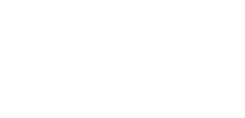

# Instruções do projeto
<p align="center">
  
</p>
<p align="center">	
   <a href="https://www.linkedin.com/in/marcusrodriguesdev">
      
   </a>
  
</p>

# ⭐ Sumário

* [Descrição](#descricão)
* [Demonstração da Aplicação](#demonstracao-da-aplicacao)
* [Meus Passos](#meus-passos)
* [Tecnologias](#Tecnologias)
* [Como rodar o projeto](#como-rodar-o-projeto)
* [Achou algum bug?](#problema)
* [Licença](#licença)

# 💻 Descrição
Uma aplicação com uma transcrição em tempo real da conversa que está ocorrendo na ligação telefônica entre o vendedor e o cliente.

# 📱 Demonstração da Aplicação
<p align="center">


https://github.com/marcusrodriguesdev/callface-challenge/assets/81593777/9a49713f-d50a-40ec-ad51-38b9ba06933f


</p>

# 🚀 Meus Passos
 - Comecei configurando o repositório, instalando bibiliotecas, configurando ambiente.
 - Analisei os requisitos e comecei a desenvolver o layout da aplicação.
 - Desenvolvi a api com os dados do vendedor e cliente.
 - Consumi esses dados e fiz a transcrição da conversa do cliente e vendedor.

# 🛠 Tecnologias
As seguintes ferramentas foram usadas na construção do projeto:
* [React](https://react.dev/)
* [TypeScript](https://www.typescriptlang.org/)
* [TailwindCss](https://tailwindcss.com/)
* [Vite](https://vitejs.dev/)
* [Eslint](https://eslint.org/)
* [Prettier](https://prettier.io/)
* [Nest](https://nestjs.com/)
* [Prisma](https://www.prisma.io/)
* [PostgreSQl](https://www.postgresql.org/)


# 🚀 Como rodar o projeto

```bash
# Clone este repositório
$ git clone git@github.com:marcusrodriguesdev/callface-challenge.git

# Acesse a pasta do projeto no terminal/cmd
$ cd callface-challenge

# Instale as dependências do front
$ cd frontend
$ npm install
$ cd ..

# Instale as dependências do backend
$ cd backend
$ npm install

# utilize postgres com docker
$ docker-compose -f docker-compose.db.yml up -d
ou
$ npm run docker:db

# run migrate
$ npx prisma migrate dev

# popule o banco com conversas e informações dos usuários
$ npm run seed

# Execute em parelelo os dois diretórios
$ cd frontend
$ npm run dev

e no backend

$ cd backend
$ npm run start:dev

# O app será aberto na porta:5173 - acesse http://localhost:5173
# A api rodará na porta:3000 - acesse http://localhost:3000
```

Se encontrar algum problema, por favor, crie uma issue [aqui](https://github.com/marcusrodriguesdev/callface-challenge/issues/). Se você já encontrou a solução para o problema, **faça um pull request**!


# 📝 Licença
Desenvolvido com 🩷 por [Marcus Rodrigues](https://www.linkedin.com/in/marcusrodriguesdev)
